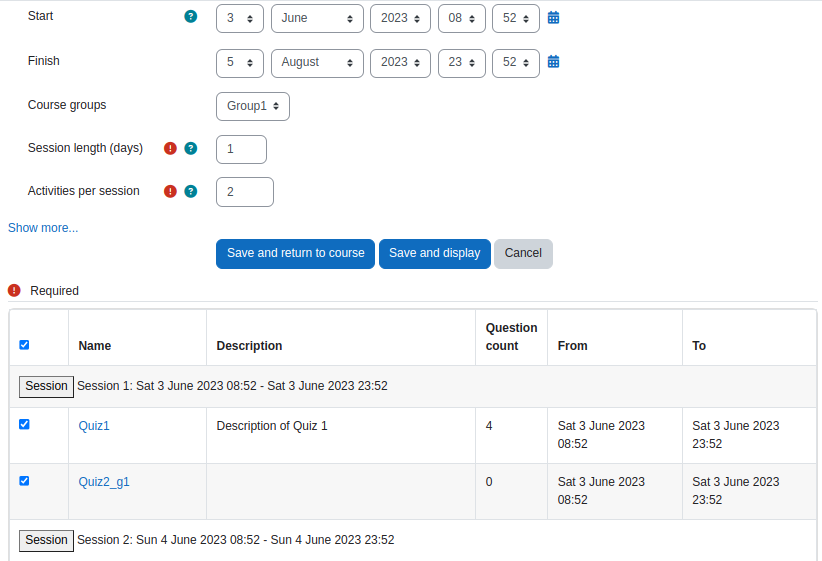

# Moodle Driprelease by Marcus Green 

 

Make quiz activities available on a timed release basis. For example An example of its use is to make a new quiz become available each  day and then replaced by a new quiz on the following day. Another scenario is to make 5 quizzes available for a week, and the following week another 5 quizzes are made available.

This project was funded by Sojo University Japan and initiated by Rob Hirschel and Chris Tempest.

For Moodle development and consultancy, contact Moodle partner Catalyst EU 

https://www.catalyst-eu.net/contact-us/brighton

The latest source can be found at

https://github.com/marcusgreen/moodle-tool_driprelease

A user guide can be found at
https://github.com/marcusgreen/moodle-tool_driprelease/wiki

All code available under the GPL License https://www.gnu.org/licenses/gpl-3.0.en.html
